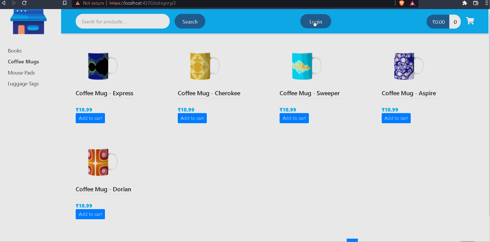
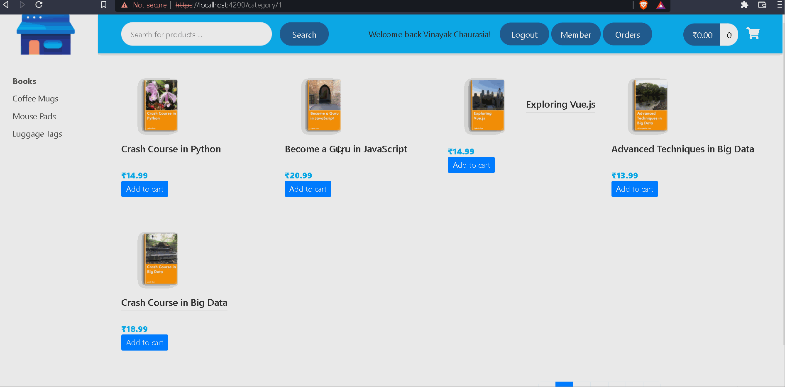
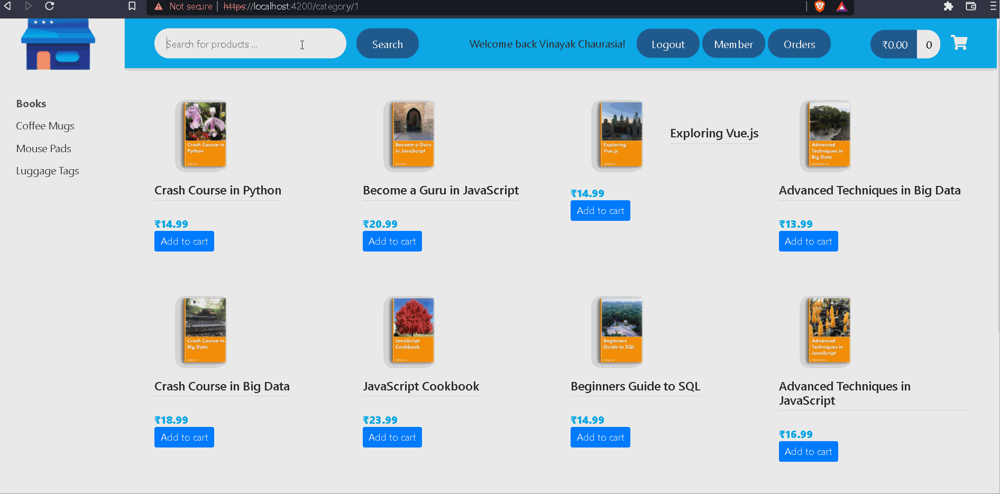
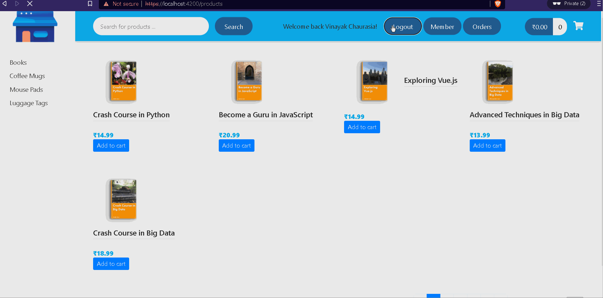

# E-commerce Application based on Spring Boot back-end and Angular front-end

## Description:
Application is build using Angular as the core framework and uses OKTA OIDC for handling security and uses Spring Boot backend API.
Project is still under development and I keep on adding new features, fixing bugs. 
This Project was started to learn Angular and How to integrate Angular applications to Spring based applications.

## Refer GIF's for some of the features

### Login

### Product category and Pagination support

### Searching Support

### Order checkout

### Logout

## Link to Spring Boot Backend:
[E-Commerce Spring Backend](https://github.com/vinayak-c/Ecommerce-SpringBoot-BackEnd-)

## Credits:
This project was part of a course on udemy by Chad Darby and Harinath Kuntamukkala.

